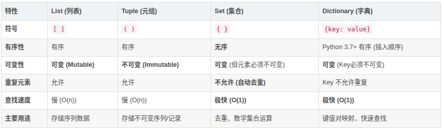

- 四种数据类型的区别(list, tuple, se, dictionary)

  

  1. list

  > **关键词：**有序，可变
  >
  > 列表是 Python 中最常用的数据结构。它可以容纳任意类型的对象，并且可以随时修改（增删改）。
  >
  > - **特点：** 元素按插入顺序排列，支持索引（Indexing）和切片（Slicing）。
  > - **常用操作：** `append`, `extend`, `pop`, `sort`。
  >
  > ```python
  > # 定义列表
  > my_list = [1, "Hello", 3.14, [1, 2]]
  > 
  > # 修改元素
  > my_list[0] = 100 
  > 
  > # 追加元素
  > my_list.append("World")
  > 
  > print(my_list) 
  > # 输出: [100, 'Hello', 3.14, [1, 2], 'World']
  > ```

  2. tuple

  > **关键词：**有序、不可变、安全
  >
  > 元组可以看作是“**只读的列表**”。一旦创建，其内部的元素就不能被修改、添加或删除。
  >
  > - **为什么用元组？**
  >   1. **安全性：** 保护数据不被意外修改。
  >   2. **性能：** 比列表占用更少的内存，迭代速度略快。
  >   3. **可哈希：** 因为不可变，所以元组可以作为字典的 Key（列表不行）。
  >
  > ```python
  > # 定义元组
  > my_tuple = (1, 2, "Python")
  > 
  > # 尝试修改会报错
  > try:
  >     my_tuple[0] = 99
  > except TypeError as e:
  >     print(f"Error: {e}") 
  >     # 输出: Error: 'tuple' object does not support item assignment
  > 
  > # 单个元素的元组陷阱
  > single_tuple = (1,) # 必须加逗号，否则是 int 类型
  > 
  > ```
  >
  > 

  3. set

  > **关键词：无序、唯一、数学运算**
  >
  > 集合是一个无序的不重复元素序列。它的底层实现与字典类似（Hash Table），因此查找速度极快。
  >
  > - **核心功能：** 自动去重。
  > - **注意：** 集合本身是可变的（可以 add/remove），但集合内的元素必须是不可变的（Hashable）。你不能在集合里放一个 List。
  > - **面试考点：** 如何创建一个空集合？
  >   - `s = {}` ❌ (这是空字典)
  >   - `s = set()` ✅ (正确写法)
  >
  > ```python
  > # 定义集合
  > my_set = {1, 2, 2, 3, 3, 3}
  > print(my_set) # 输出: {1, 2, 3} (自动去重)
  > 
  > # 集合运算
  > set_a = {1, 2, 3}
  > set_b = {3, 4, 5}
  > 
  > print(set_a & set_b) # 交集: {3}
  > print(set_a | set_b) # 并集: {1, 2, 3, 4, 5}
  > print(set_a - set_b) # 差集: {1, 2}
  > ```
  >
  > 

  4.dictionary

  >**关键词：键值对、哈希表、极速查找**
  >
  >字典由 Key (键) 和 Value (值) 组成。它是通过 Key 来直接访问 Value，而不是通过索引位置。
  >
  >- **Key 的限制：** 必须是**不可变类型**（如字符串、数字、元组）。
  >- **Value 的限制：** 无限制，可以是任何对象。
  >- **性能：** 无论数据量多大，通过 Key 查找 Value 的时间复杂度接近 O(1)。
  >
  >```python
  ># 定义字典
  >user_info = {
  >    "name": "Gemini",
  >    "age": 1,
  >    "skills": ["Coding", "Writing"]
  >}
  >
  ># 快速查找
  >print(user_info["name"]) # 输出: Gemini
  >
  ># 添加/修改
  >user_info["location"] = "Cloud"
  >
  ># 获取所有键值对
  >for k, v in user_info.items():
  >    print(f"{k}: {v}")
  >```
  >
  >

  **选用建议**

  > 在实际开发中，请参考以下决策逻辑： 
  >
  > 1. 你需要存储“键值对”吗？
  >    是 → Dictionary (例如：用户信息，配置项)
  > 2. 你需要数据去重，或者进行数学集合运算吗？
  >    是 → Set (例如：计算共同好友，ID去重）
  > 3. 你需要数据是“只读”的，或者作为字典的Key吗？
  >    是 →Tuple (例如：经纬度坐标，数据库查询结果的一行)
  > 4. 如果以上都不是，你需要一个有序、可变的容器：
  >    是 → List (绝大多数常规场景，类似于 C/C++ 中的“数组”)

  ***总结***

  > - **List** 是最灵活的数组（类似于 C/C++ 中的数组）。
  > - **Tuple** 是不可变的数组，更轻量、更安全。
  > - **Set** 是为了去重和数学运算而生的。
  > - **Dictionary** 是为了通过 Key 快速检索数据而生的。

  

- 变量

  > - 在 Python 中，**一切数据都是对象**，包括数字、字符串、函数、类、模块本身。
  >   而变量不是“存储数据的盒子”，而是**指向对象的引用（名字绑定）**
  > - 在 C++ 里，变量类似一个固定类型的内存箱子，改变变量就是改变箱子里的内容；
  >   在 Python 里，变量名只是一个标签，可以贴到不同的对象上。
  >
  > ```python
  > a = 10
  > b = a
  > print(a is b)   # True，a 和 b 指向同一个对象
  > 
  > a = 20
  > print(b)        # 10，b 仍然指向原来的 10 对象，不受影响
  > ```
  >
  > - `a = 10`：创建一个整数对象 `10`，让名字 `a` 指向它。
  > - `b = a`：让名字 `b` 也指向同一个对象 `10`。
  > - `a = 20`：创建新对象 `20`，让 `a` 指向它，`b` 仍然指向旧对象 `10`
  > - 所以变量只是名字，不是固定容器。
  >
  > - 面试常问
  >
  >   - Python 中变量和 C 变量有什么区别？
  >   - 为什么说 Python 没有值传递和引用传递之分？其实是“对象引用传递”。
  >   - 如何理解 `a is b` 和 `a == b`？
  >
  > - 回答要点
  >
  >   1. Python 变量是引用/名字绑定，不是内存位置。
  >   2. 赋值语句是“让名字指向对象”，而不是“把值放进变量”。
  >   3. 所有对象都有身份（id）、类型（type）、值（value）三要素。
  >      - 对象身上贴的标签（引用数）变成 0 → 马上销毁
  >
  > - ### 可能的追问
  >
  > - **问：Python 函数参数传递是值传递还是引用传递？**
  >   答：既不是传统值传递，也不是传统引用传递，而是“对象引用传递”。函数参数得到的是对象的引用，所以如果传入可变对象，函数内修改会影响外部；如果重新绑定参数名，不影响外部。
  >
  >   ```python
  >   def f(x):
  >       x.append(1)     # 修改指向的对象，外部可见
  >   
  >   def g(y):
  >       y = [2,3]       # 重新绑定名字，外部不可见
  >   
  >   a = [0]
  >   f(a)
  >   print(a)   # [0,1]
  >   g(a)
  >   print(a)   # [0,1]，还是原来的对象
  >   ```
  >
  >   可变对象：list dict set
  >
  >   ​	对象本身的内容，可以**原地修改**，不需要新建对象
  >
  >   不可变对象：int str float tuple bool frozenset。
  >
  >   ​	对象一旦创建，内容**永远不能原地修改**。你 “修改” 它的时候，本质是生成一个**全新对象**。
  >
  > ***总结***
  >
  > C 语言变量对应一块独立的内存空间，数值直接存储在该空间内，赋值会原地修改内存的值。 Python 的变量是对象的引用，存储的是对象的内存地址；能否修改对象内容取决于对象是否可变，不可变对象无法原地修改，赋值只会让变量指向新对象。

- 可变对象VS不可变对象

  > - **不可变对象**：一旦创建，值不能改变。如 `int`、`float`、`str`、`tuple`、`frozenset`。
  >
  > - **可变对象**：创建后值可以改变。如 `list`、`dict`、`set`、自定义类的实例（通常）。
  >
  > - 注意：变量绑定的是对象，修改可变对象会影响所有指向它的变量。
  >
  > - ### 面试常问
  >
  >   - 列表和元组的区别？元组真的不可变吗？
  >   - 为什么 Python 默认参数不要用可变对象？
  >
  > - ### 回答要点
  >
  >   1. 不可变对象保证了哈希值稳定，所以可以作为字典键；可变对象不能作为字典键。
  >
  >   2. 元组本身不可变，但元素可能是可变对象，比如 `([1,2], 3)`，列表可以修改。
  >
  >   3. 可变默认参数会导致多次调用共享同一个默认对象，产生意外行为。
  >
  >      
  >
  >   示例（经典坑）：
  >
  >   ```python
  >   def f(a, lst=[]):
  >       lst.append(a)
  >       return lst
  >   
  >   print(f(1))   # [1]
  >   print(f(2))   # [1,2]，因为默认参数 lst 是同一个列表对象
  >   ```
  >
  >   正确做法：
  >
  >   ```python
  >   def f(a, lst=None):
  >       if lst is None:
  >           lst = []
  >       lst.append(a)
  >       return lst
  >   ```
  >
  > ***总结***
  >
  > 1. python函数的默认参数会再函数定义的时候被创建且不会被销毁被该函数的内部对象一直引用这不会被销毁__defaults__

- 深拷贝VS浅拷贝

  > - **浅拷贝**：只复制最外层对象，内部元素仍然引用原对象的元素。
  > - **深拷贝**：复制对象及其内部所有嵌套对象，完全独立。
  >
  > ```python
  > import copy
  > shallow = copy.copy(obj)
  > deep = copy.deepcopy(obj)
  > ```
  >
  > ```python
  > import copy
  > 
  > a = [[1,2], [3,4]]
  > b = copy.copy(a)        # 浅拷贝
  > c = copy.deepcopy(a)    # 深拷贝
  > 
  > b[0].append(99)
  > print(a)   # [[1,2,99], [3,4]]  影响原对象
  > print(b)   # [[1,2,99], [3,4]]
  > 
  > c[1].append(88)
  > print(a)   # [[1,2,99], [3,4]]  深拷贝不影响原对象
  > print(c)   # [[1,2], [3,4,88]]
  > ```
  >
  > - 面试常问
  >   - 深拷贝和浅拷贝的区别？
  >   - 列表的切片 `a[:]` 是深拷贝还是浅拷贝？（浅拷贝）
  >   - `copy.copy` 和 `list()` 一样吗？
  > - 回答要点
  >   1. 浅拷贝复制容器结构，内部元素共享；深拷贝递归复制所有层。
  >   2. 切片 `a[:]` 创建新列表，但元素引用不变，是浅拷贝。
  >   3. 对于不可变对象，深拷贝可能返回原对象（因为不可变，无需复制）。
  >
  > ***总结***
  >
  > - 深拷贝 :
  >   1. 如果当前对象是**可变对象**：创建一份全新副本，递归拷贝内部元素。
  >   2. 如果当前对象是**不可变对象**：
  >      - 内部**不存在任何可变的嵌套子对象** → 直接返回原始对象，不复制（优化）
  >      - 内部**嵌套了可变对象** → 必须新建副本
  >   3. 深拷贝的目标：**做到两个对象完全独立，修改一个不会影响另一个**。
  > - 切片 `a[:]` 创建新列表,里面的元素还都是原来的对象所以是浅拷贝

- is 和 ==

  > 1. `==` 调用 `__eq__`，`is` 直接比较 `id`。
  > 2. Python 解释器会缓存小整数（-5 到 256）和某些字符串，导致 `is` 返回 True。
  > 3. 实际比较值时用 `==`，判断是否同一对象时用 `is`，不要混用。
  >
  > - 超出小整数值
  >
  >   在单个 py 脚本里面，编译器**常量折叠优化**有时也会让 `x=257;y=257; x is y` 返回 True,但是**交互式终端一行一行敲，一定 False**。
  >
  > - 字符串驻留
  >
  >   标识符：只能由字母、数字、下划线组成，**不能带空格、特殊符号**

- 垃圾回收机制

  > - Python 主要使用**引用计数**作为主要垃圾回收机制，辅以**标记清除**和**分代回收**处理循环引用。
  >
  >   1. **引用计数**：每个对象维护一个计数器，当引用增加时 +1，减少时 -1，归零时立即回收。
  >   2. **标记清除**：解决循环引用问题，比如两个对象互相引用但外部无法访问。
  >   3. **分代回收**：将对象按存活时间分为三代，新对象在年轻代，经常回收，存活久的对象移到老年代，减少检查频率。
  >
  >   ```python
  >   import sys
  >   
  >   a = []
  >   print(sys.getrefcount(a))  # 2（a 和参数本身）
  >   
  >   b = a
  >   print(sys.getrefcount(a))  # 3
  >   
  >   del b
  >   print(sys.getrefcount(a))  # 2
  >   ```
  >
  >   ```python
  >   #循环引用
  >   class Node:
  >       def __init__(self):
  >           self.ref = None
  >   
  >   a = Node()
  >   b = Node()
  >   a.ref = b
  >   b.ref = a
  >   
  >   del a
  >   del b
  >   # 两个对象互相引用，引用计数不为 0，但标记清除会检测并回收
  >   ```
  >
  >   ### 面试常问
  >
  >   - Python 垃圾回收机制？
  >   - 为什么引用计数不能解决循环引用？
  >   - `gc` 模块的作用？
  >
  >   ### 回答要点
  >
  >   1. 引用计数是主要机制，实时回收。
  >   2. 循环引用导致计数永远不为 0，需要标记清除。
  >   3. 分代回收提高效率，新对象更频繁检查。

- list

  > ### 核心概念
  >
  > Python 的列表在底层是**动态数组**，不是链表。
  > 它维护一个连续内存块的引用数组，每个元素存放的是对象引用（指针），而不是对象本身。
  > 当元素数量超过当前分配容量时，列表会**动态扩容**，新分配一个更大的连续内存块，把旧元素引用复制过去，再插入新元素。
  >
  > ### 扩容机制
  >
  > - 初始容量：空列表容量为 0。
  > - 增长策略：当容量不足时，新容量约为旧容量的 1.125 倍（源码中 `new_allocated = (size >> 3) + (size < 9 ? 3 : 6)`），但实际实现是**过度分配**，会预留空间避免频繁扩容。
  > - 均摊时间复杂度：`append` 操作平均 O(1)，但偶尔一次扩容是 O(n)。
  >
  > ```python
  > import sys
  > 
  > lst = []
  > print(sys.getsizeof(lst))   # 空列表占用 56 字节
  > 
  > lst.append(1)
  > print(sys.getsizeof(lst))   # 扩容后可能 88 字节，预留了空间
  > 
  > for i in range(1000):
  >     lst.append(i)
  > print(sys.getsizeof(lst))   # 容量远大于元素实际占用
  > ```
  >
  > ### 面试常问
  >
  > - 列表底层用什么数据结构？
  > - 为什么 `append` 是 O(1) 均摊，而不是严格 O(1)？
  > - 列表插入和删除元素的时间复杂度？
  >   - 末尾插入 O(1) 均摊
  >   - 中间插入/删除 O(n)，因为需要移动后续元素
  >   - 按下标访问 O(1)
  >   - 查找元素 O(n)
  >
  > ### 回答要点
  >
  > 1. 列表是动态数组，连续内存存引用。
  > 2. 扩容时分配更大数组并复制引用，所以有额外内存开销。
  > 3. 插入/删除中间元素涉及元素移动，时间复杂度 O(n)。
  >
  > ### 可能的追问
  >
  > **问：为什么列表元素可以是不同类型？**
  > 答：列表存储的是对象引用，每个引用大小固定，指向的对象类型可以不同。
  >
  > **问：`list.insert(0, item)` 和 `list.append(item)` 哪个快？**
  > 答：`append` 快，因为 `insert(0)` 需要把已有元素全部后移一位，O(n)。

- tuple

  >### 核心概念
  >
  >元组是不可变容器，元组本身不能改变其元素引用（不能增删改）。
  >但元组中的元素如果是可变对象（如列表），那个可变对象的内部内容可以改变。
  >这并不违反元组不可变的定义，因为元组保存的是引用，引用没有变，引用指向的对象内部变了。
  >
  >```python
  >t = ([1, 2], 3)
  >print(t[0])       # [1, 2]
  >
  >t[0].append(99)   # 修改列表内部，允许
  >print(t)          # ([1, 2, 99], 3)
  >
  >t[0] = [4,5]      # 报错！不能改变元组中引用
  >```
  >
  >### 面试常问
  >
  >- 元组是不可变对象吗？
  >- 为什么元组可以作为字典键，列表不行？
  >- 元组和列表的区别？
  >
  >### 回答要点
  >
  >1. 元组不可变是指元组容器内的引用不可变，但引用指向的可变对象可以变。
  >2. 因为元组不可变，所以哈希值稳定，能作为字典键；列表可变，哈希值不稳定，不能作为键。
  >3. 元组比列表更轻量，适合作为常量集合；列表适合动态数据。
  >
  >### 可能的追问
  >
  >**问：如何定义一个只有一个元素的元组？**
  >答：`(1,)`，不能写 `(1)`，因为那是整数 1。
  >
  >**问：元组真的比列表快吗？**
  >答：元组创建后大小固定，内存分配更简单，迭代访问可能略快，但差异通常不大。

- dict (底层实现)

  > ### 核心概念
  >
  > Python 3.6+ 的字典底层是**哈希表**，采用**开放寻址法**处理冲突。
  > 每个键通过 `hash()` 函数计算哈希值，映射到哈希表中的一个位置。
  > 为了保持插入顺序（Python 3.7 起字典有序），内部还有一个辅助索引数组记录插入顺序和哈希表槽位。
  >
  > ### 哈希表结构
  >
  > - `hash(key)` 得到整数哈希值
  > - 哈希值经过扰动（如高位参与低位计算）得到初始槽位
  > - 如果槽位被占用，就按探测序列查找下一个空位（线性探测或二次探测）
  > - 当装载因子过高时，哈希表扩容，重新计算所有键的槽位
  >
  > ```python
  > d = {'a':1, 'b':2}
  > print(hash('a'))   # 哈希值，每次运行可能不同（随机化）
  > print(d['a'])      # O(1) 平均
  > ```
  >
  > ### 面试常问
  >
  > - 字典为什么查找快？时间复杂度？
  > - 字典的键有什么要求？
  > - 字典扩容的过程？
  > - Python 3.7 字典为什么有序？
  >
  > ### 回答要点
  >
  > 1. 字典基于哈希表，平均查找/插入/删除 O(1)。
  > 2. 键必须是可哈希的（不可变对象），即 `hash(key)` 且不可变。
  > 3. 扩容时新哈希表容量通常加倍，重新哈希所有键，因为哈希表大小变了，槽位也要重新计算。
  > 4. 有序性来自内部索引数组记录插入顺序，不是哈希表本身有序。
  >
  > ### 可能的追问
  >
  > **问：自定义类的对象可以作为字典键吗？**
  > 答：可以，但必须实现 `__hash__` 和 `__eq__`，且哈希值在对象生命周期内不变。
  >
  > **问：为什么字典键不能是列表？**
  > 答：列表可变，哈希值会变，且无法稳定定位槽位。

- 集合与字典的区别

  > ### 核心概念
  >
  > 集合（set）也是基于哈希表，但只存储键，不存储值。
  > 集合元素必须是不可变对象，集合支持交、并、差、对称差等集合运算。
  >
  > ### 面试常问
  >
  > - 集合和字典有什么关系？
  > - 集合的时间复杂度？
  > - 如何去除列表中的重复元素？
  >
  > ### 回答要点
  >
  > 1. 集合是“没有值的字典”，底层也是哈希表。
  > 2. 集合的查找、插入、删除平均 O(1)。
  > 3. 去重常用 `set(list)`，但会丢失顺序；保持顺序可以用 `dict.fromkeys` 或遍历判断。
  >
  > ```python
  > lst = [1,2,2,3,4,4]
  > print(list(set(lst)))   # [1,2,3,4] 无序
  > print(list(dict.fromkeys(lst)))  # [1,2,3,4] 保持原顺序
  > ```

- 列表推导式 vs 生成器表达式

  > ### 核心概念
  >
  > - **列表推导式**：立即生成一个完整的列表，占用内存与元素个数成正比。
  > - **生成器表达式**：返回一个生成器对象，惰性计算，不立即生成所有元素，节省内存。
  >
  > ```python
  > list_comp = [x*x for x in range(10)]
  > gen_exp = (x*x for x in range(10))
  > ```
  >
  > ```python
  > import sys
  > 
  > lst = [x for x in range(1000000)]
  > gen = (x for x in range(1000000))
  > 
  > print(sys.getsizeof(lst))   # 可能几十 MB
  > print(sys.getsizeof(gen))   # 只有生成器对象本身，很小
  > ```
  >
  > ### 面试常问
  >
  > - 列表推导式和生成器表达式区别？
  > - 什么时候用生成器表达式？
  > - 生成器表达式为什么省内存？
  >
  > ### 回答要点
  >
  > 1. 列表推导式立即求值，返回列表；生成器表达式延迟求值，返回生成器。
  > 2. 处理大量数据或无限序列时用生成器表达式，避免内存溢出。
  > 3. 生成器只保存计算状态，不保存所有结果，所以内存占用小。

- 切片操作的底层原理

  > ### 核心概念
  >
  > 切片语法 `a[start:stop:step]` 用于获取序列的一部分。
  > 底层调用序列对象的 `__getitem__` 方法，传入 `slice(start, stop, step)` 对象。
  > 对于列表，切片返回一个**新列表**，元素是原列表元素的引用（浅拷贝）。
  >
  > ```python
  > a = [1,2,3,4,5]
  > print(a[1:4])      # [2,3,4]
  > print(a[::-1])     # [5,4,3,2,1] 反转
  > 
  > # 相当于
  > s = slice(1,4,1)
  > print(a[s])        # [2,3,4]
  > ```
  >
  > ### 面试常问
  >
  > - 切片是深拷贝还是浅拷贝？
  > - 如何反转列表？
  > - 切片参数如何理解？
  >
  > ### 回答要点
  >
  > 1. 切片是浅拷贝，只复制外层容器，元素引用不变。
  > 2. 反转列表可以用 `a[::-1]` 或 `a.reverse()`（原地反转）。
  > 3. `start` 省略默认 0，`stop` 省略默认到末尾，`step` 省略默认 1，负数 step 表示反向。

  

